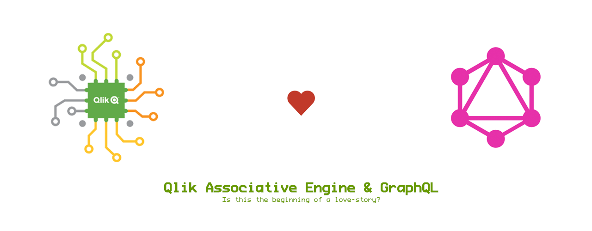
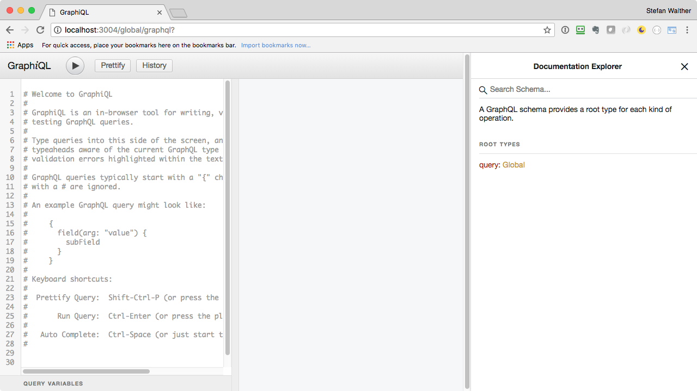
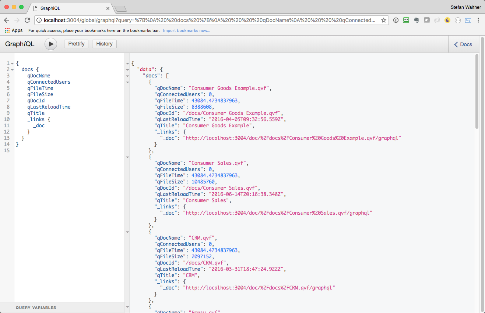
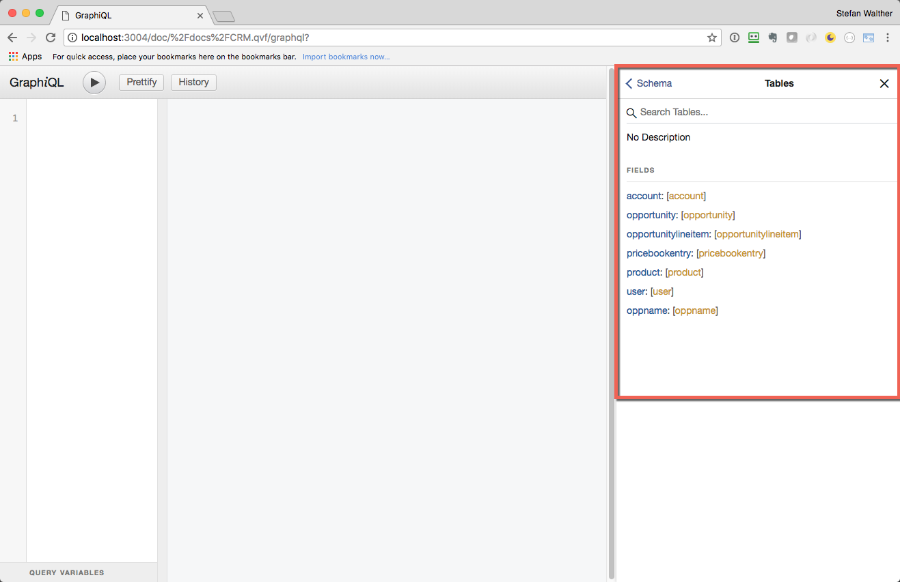
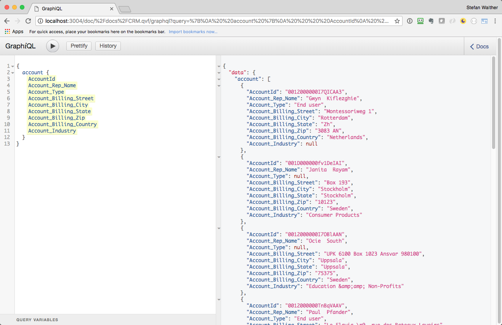
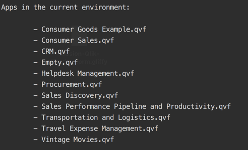

# qix-graphql [](https://circleci.com/gh/stefanwalther/qix-graphql) [](https://codecov.io/gh/stefanwalther/qix-graphql)

> GraphQL Server on top of the Qlik Associative Engine (a.k.a. QIX Engine).



## Table of Contents

<details>

- [Motivation](#motivation)
- [Getting started](#getting-started)
- [Features](#features)
- [Installation](#installation)
- [Roadmap](#roadmap)
- [Contribution](#contribution)
- [About](#about)
  * [Author](#author)
  * [License](#license)

_(TOC generated by [verb](https://github.com/verbose/verb) using [markdown-toc](https://github.com/jonschlinkert/markdown-toc))_

</details>

## Motivation
_qix-graphql_ provides a [GraphQL](https://graphql.org/) server sitting on top of the powerful Qlik Associative Engine (a.k.a. QIX Engine), regardless whether it is Qlik Sense Enterprise, a solution build with [Qlik Core](https://qlikcore.com/) or Qlik Sense Multi Cloud.

Using GraphQL next to QIX provides a completely new experience how to develop custom solutions:

- Use the powerful tooling from the [GraphQL community](https://github.com/chentsulin/awesome-graphql), such as [GraphiQL](https://github.com/graphql/graphiql).
- Connect to Qlik environments and Qlik apps in most of the major programming languages, such as C#, Go, Java, JavaScript, Swift, Python, always with the same experience.
- There is no need anymore to understand Qlik specific constructs such as qHyperCube, SessionObjects, etc., just use GraphQL.
- Leverage the benefits of a strongly typed system (e.g in IDEs such as Visual Studio Code).

## Getting started
Before we connect to various environments (such as Qlik Sense Enterprise, Qlik Core solutions, etc.), let's get started with a *simple demo*.

<details>
<summary>Getting the demo up and running</summary>

The demo will consist of the following logical components:

- A QIX Engine (using the the Qlik Core Engine container)
- A few demo apps mounted to the QIX Engine
- A GraphQL server connected to the QIX Engine

All services will be spawn up using docker-compose (which requires e.g. Docker for Mac/Windows running on your machine).

As this demo is included in the _qix-graphql_ repo, the easiest way to get started is to clone this repo:

```
$ git clone https://github.com/stefanwalther/qix-graphql
```

Then run the following command: 

```
$ QIX_ENGINE_VER=12.171.0 QIX_ACCEPT_EULA=yes docker-compose up -d
```
Note: `QIX_ENGINE_VER` and `QIX_ACCEPT_EULA` are environment variables being used in the docker-compose file.

</details>

### Explore the GraphQL API using the GraphiQL IDE

<details>
<summary>Explore the GraphQL server using GraphiQL</summary>

We can now open http://localhost:3004/global/graphql in your browser to get the [GraphiQL](https://github.com/graphql/graphiql) user interface.
GraphiQL is a graphical interactive in-browser GraphQL IDE, which allows you to explore the API being provided by _qix-graphql_, the GraphQL server.



We can also easily get a list of all documents in the IDE:



Note: GraphiQL also provides intellisense, built-in documentation and more, see here for some [tipps & tricks for GraphiQL](./docs/about-graphiql.md).

In the examples above we have acted on the *global* scope, which allows us to explore meta-information about different Qlik documents.

Using the URL stated in `doc/_links/_docs` we can connect to a single document.

</details>

<details>
<summary>Explore the API of a single document, using GraphiQL</summary>

If we use (as defined by this demo) `http://localhost:3004/doc/:qDocId/graphql` we connect to a single document and its API:

Going to the built-in documentation, we'll see the tables of this document we can query:



So let's query one of those tables (in this example the table `account` on the doc `CRM.qvf`:



</details>

### Developing a Client

<details>
<summary>Creating a client in node.js</summary>
OK, so far we have seen that we can easily explore the generated APIs on a global and on a doc scope.  
Now let's create some code so see how we can use the server when developing a custom application using the GraphQL server. It can basically be any kind of an application, a backend-service, a website, a native mobile app; essentially the approach is always the same:

```js
const client = require('graphql-client')({
  url: 'http://localhost:3004/global/graphql'
});

async function getDocs() {
  const query = `{
              docs {
                qDocId
                qDocName
              }
            }`;
  const vars = '';
  return await client.query(query, vars);
}

(async () => {
  let result = await getDocs();
  console.log('Apps in the current environment:\n');
  result.data.docs.forEach(item => {
    console.log(`\t- ${item.qDocName}`);
  });
})();
```

This will return:



So we don't need to use enigma.js, we don't need to understand specific constructs of the QIX Engine such as qHyperCube, it's basically a very straightforward development experience using common tools.

</details>

## Features
_qix-graphql_ provides two basic different types of endpoints:

**Global Scope:**

- Getting information about one environment (e.g. listing all Qlik docs, etc.)

`http(s)://<qix-graphql-host>:<qix-graphql-port>/global/graphql`

**Doc Scope:**

- Connecting to a single Qlik document to perform operations such as
  - Getting the data from the given document
  - Being able to query the various tables & fields
  - Making selections
  - Creating on demand hypercubes
  - etc.
  
`http(s)://<qix-graphql-host>:<qix-graphql-port>/doc/:qDocId/graphql`

## Installation
_qix-graphql_ is already packaged as Docker image ([stefanwalther/qix-graphql](https://hub.docker.com/r/stefanwalther/qix-graphql/)).

```
$ docker run -d -p 3004:3004 stefanwalther/qix-graphql
```

### Configuration

The following configuration parameters are available:

- `HOST` - Host of the GraphQL server, defaults to `localhost`
- `PORT` - Port of the GraphQL server, defaults to `3004` 
- `QIX_HOST` - Host of the QIX Engine, defaults to `qix`
- `QIX_PORT`- Port of the QIX Engine, defaults to `9076`

## Roadmap
The work has been split into a few iterations:

- **[Iteration 1: Core prototyping work](https://github.com/stefanwalther/qix-graphql/projects/2)** **_<== !!! Sorry to say: WE ARE HERE !!!_**
  - Focus on core functionality
  - Testing various ideas/concepts
  - No UI work
  - Little documentation
  - Sometimes Messy code ;-)
  - Unstable APIs
- **[Iteration 2: Some work on enhanced concepts](https://github.com/stefanwalther/qix-graphql/projects/3)**
  - JWT support / Section Access
  - Using multiple engines, using mira 
  - Using in Qlik Sense Multi Cloud
- **Iteration 3: Clean UI & additional functionality**

See [projects](https://github.com/stefanwalther/qix-graphql/projects) for more details.

## Contribution
I am actively looking for people out there, who think that this project is an interesting idea and want to contribute.

<details>
<summary><strong>Contributing</strong></summary>
Pull requests and stars are always welcome. For bugs and feature requests, [please create an issue](https://github.com/stefanwalther/qix-graphql/issues). The process for contributing is outlined below:

1. Create a fork of the project
2. Work on whatever bug or feature you wish
3. Create a pull request (PR)

I cannot guarantee that I will merge all PRs but I will evaluate them all.
</details>

<details>
<summary><strong>Local Development</strong></summary>

The easiest way to develop locally is follow these steps:

1) Clone the GitHub repo
```
$ git clone https://github.com/stefanwalther/qix-graphql
```

2) Install the dependencies
```
$ npm install
```

3) Start the dependencies (Qlik Associative Engine + a few sample apps mounted):
```
$ make up-deps
```

Make your code changes, then:

- Run local tests: `npm run test`
- Run local tests with a watcher: `npm run test`
- Start the GraphQl server: `npm run start`
- Start the GraphQl server with a watcher: `npm run start:watch`

</details>

<details>
<summary><strong>Running Tests</strong></summary>

Having the local dependencies up and running, you can just run the tests by executing:

```
$ npm run test
```

If you want to have an watcher active, use:

```
$ npm run test:watch
```

</details>

<details>
<summary><strong>CircleCI Tests</strong></summary>

To simulate the tests running on CircleCI run the following:

```
$ make circleci-test
```

</details>

## About
### Author
**Stefan Walther**

* [twitter](http://twitter.com/waltherstefan)  
* [github.com/stefanwalther](http://github.com/stefanwalther) 
* [LinkedIn](https://www.linkedin.com/in/stefanwalther/) 
* [qliksite.io](http://qliksite.io)

### License
MIT

***

_This file was generated by [verb-generate-readme](https://github.com/verbose/verb-generate-readme), v0.6.0, on June 01, 2018._

